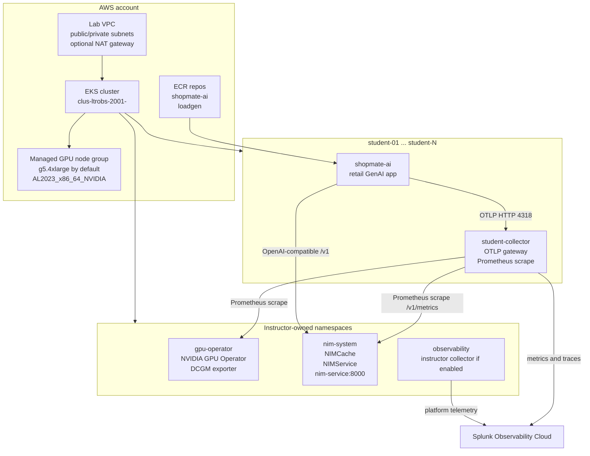

# Architecture

The lab uses a shared platform with isolated student workspaces. Students learn the observability path by configuring their own namespace-scoped collector and app telemetry, while instructors own cluster lifecycle, GPU services, NIM, credentials, and cleanup.

## Platform Shape



## Responsibilities

| Component | Owner | Notes |
| --- | --- | --- |
| AWS account, VPC, EKS, node group, ECR | Instructor | Terraform-owned. Students never need AWS access. |
| GPU Operator and DCGM exporter | Instructor | Installed by Terraform when `install_gpu_operator=true`. |
| NIM endpoint | Instructor | Requires NVIDIA NGC credentials and model entitlement. |
| Splunk org, realm, ingest token | Instructor | Use a lab-scoped token and rotate or delete it after class. |
| Student namespaces and RBAC | Instructor | Terraform creates `student-01` through `student-N` when `manage_kubernetes_baseline=true`. |
| Student collector | Student exercise | Namespace-scoped gateway. No DaemonSet and no cluster receiver. |
| ShopMate app | Student exercise or instructor smoke test | Emits traces, GenAI telemetry, token metrics, and calls shared NIM. |

## Terraform Managed Scope

The Terraform stack in `infra/terraform` manages:

- VPC, public subnets, private subnets, route tables, internet gateway, optional NAT gateway, and Elastic IP
- EKS cluster
- managed GPU node group
- EKS core add-ons
- optional EBS CSI add-on and IRSA role
- optional NVIDIA GPU Operator Helm release
- ECR repositories
- `gpu-operator`, `nim-system`, and `observability` namespaces
- generated student namespaces
- per-student `student` service account, Role, and RoleBinding

It does not currently manage:

- Terraform backend bucket and lock table creation
- Splunk ingest token creation
- Splunk user creation
- NVIDIA NGC API keys or NIM entitlement
- registry credentials outside ECR
- student kubeconfig generation and distribution
- full Splunk dashboard provisioning

## Naming

| Item | Default |
| --- | --- |
| Project | `clus-ltrobs-2001` |
| Environment examples | `dev`, `dry-run`, `event` |
| Cluster name | `clus-ltrobs-2001-<environment>` unless `cluster_name` is set |
| Student namespaces | `student-01`, `student-02`, ... |
| Platform namespaces | `gpu-operator`, `nim-system`, `observability` |
| Student collector service | `student-collector` |
| App service | `shopmate-ai` |
| NIM service | `nim-service.nim-system.svc.cluster.local:8000` |
| DCGM service | `nvidia-dcgm-exporter.gpu-operator.svc.cluster.local:9400` |
| Splunk Secret per student namespace | `splunk-observability-token` |

## Tagging

Every AWS resource managed by Terraform should carry these required tags:

```text
Project=clus-ltrobs-2001
Environment=<dev|dry-run|event>
Stack=<cluster-name>
Owner=<team-or-person>
ExpiresAt=<date-time>
ManagedBy=terraform
```

These tags are not cosmetic. They are how instructors validate post-destroy cleanup and unexpected spend.

## Teaching Boundary

Students configure app telemetry and targeted GPU/NIM scraping from their own collector. Instructors do not give students cluster-wide access, GPU node control, AWS console access, NGC credentials, or direct Splunk ingest tokens.

In production, duplicate scraping of shared DCGM/NIM endpoints by every student collector would not be the preferred pattern. In this workshop it is an intentional learning exercise with a focused allowlist and conservative scrape interval.
