# Instructor Runbook

This MkDocs site is the instructor-only runbook for standing up, operating, validating, and destroying the `CLUS-LTROBS-2001` GPU lab cluster.

It documents the current repo implementation path:

- AWS EKS
- managed GPU node group, `g5.4xlarge` by default
- NVIDIA accelerated EKS AMI
- NVIDIA GPU Operator with DCGM exporter
- shared NVIDIA NIM endpoint
- shared Splunk Observability Cloud org
- one namespace-scoped Splunk OpenTelemetry Collector per student
- one `shopmate-ai` app deployment per student namespace
- Terraform-owned AWS lifecycle

!!! warning "Instructor-only"
    Do not publish this site to students. It includes lifecycle, credential-handling, validation, reset, and destroy steps that students should not run.

## What This Site Covers

| Area | Outcome |
| --- | --- |
| Prerequisites | Confirm AWS, GPU quota, Splunk, NVIDIA NGC/NIM, registry, and operator tooling before creating anything. |
| Terraform deploy | Build the VPC, EKS cluster, GPU node group, add-ons, ECR repos, namespaces, service accounts, and namespace RBAC from `infra/terraform`. |
| Platform services | Validate GPU Operator/DCGM, deploy NIM with the checked-in manifest shape, publish the app image, and confirm shared services are reachable. |
| Splunk setup | Create the lab-scoped ingest token, preload namespace Secrets, and verify collector export behavior. |
| Student environments | Prepare roster values, kubeconfigs or access handouts, lab files, and namespace smoke tests. |
| Validation | Run pre-event and day-of checks before opening the room. |
| Operations | Reset failed student namespaces without destroying the cluster. |
| Destroy | Tear the environment down with Terraform and prove that no GPU, EKS, NAT, load balancer, EBS, or token exposure remains. |

## Source Of Truth

Use these repo paths while following this guide:

```text
infra/terraform/
infra/k8s/gpu-operator-values.yaml
infra/k8s/nim-llama-3.2-1b.yaml
infra/k8s/shopmate-ai.yaml
infra/scripts/preload-splunk-observability-token.sh
infra/scripts/validate-instructor-platform.sh
infra/helm/student-collector-values-student-01.yaml
infra/helm/student-collector-values-student-02.yaml
workshop/lab-files/
workshop/
```

The current student guide is separate and uses `mkdocs.yml`. This instructor site uses `mkdocs-instructors.yml`.

## Build Locally

```bash
python3 -m venv .venv
. .venv/bin/activate
pip install -r requirements-docs.txt
mkdocs build --strict -f mkdocs-instructors.yml
mkdocs serve -f mkdocs-instructors.yml -a 127.0.0.1:8002
```

## Lifecycle Summary

```mermaid
flowchart LR
  A["Prepare accounts, quotas, tokens"] --> B["Terraform apply"]
  B --> C["Configure kubectl"]
  C --> D["Validate GPU Operator and DCGM"]
  D --> E["Deploy NIM"]
  E --> F["Publish ShopMate image"]
  F --> G["Preload Splunk token Secrets"]
  G --> H["Validate one student path"]
  H --> I["Run class"]
  I --> J["Reset or support namespaces"]
  J --> K["Destroy with Terraform"]
  K --> L["Validate zero leftover spend"]
```



## Non-Goals

This guide does not ask students to create AWS, NVIDIA, registry, or Splunk ingest credentials. It also does not document per-student GPU clusters. The selected model is one shared GPU cluster with isolated student namespaces.

The archived planning thread discussed a shared OpenShift/ROSA shape. The checked-in infrastructure target is now AWS EKS. Use this EKS runbook unless the lab team intentionally pivots the implementation.
