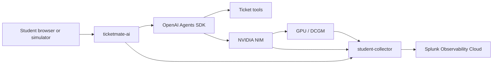

# TicketMate AI Observability Workshop

TicketMate AI is a separate workshop track from ShopMate. In this three-hour lab, you start from an empty student namespace and finish with a fully instrumented GenAI application workflow:

- Splunk OpenTelemetry Collector gateway
- APM traces for `ticketmate-ai`
- GenAI spans and token metrics
- OpenAI Agents SDK tool-call monitoring
- NIM model-serving metrics
- GPU metrics from the AI POD layer
- tokenomics dashboard by student, department, and chargeback account
- token spike detector triggered by simulator traffic

## Three-Hour Agenda

| Time | Module | Outcome |
| --- | --- | --- |
| 0:00-0:20 | Orientation | Confirm namespace, Splunk, NIM, and lab goal |
| 0:20-0:50 | Collector setup | Student collector receives OTLP and scrapes GPU/NIM metrics |
| 0:50-1:20 | App deploy | TicketMate runs with OTEL and NIM settings |
| 1:20-1:45 | GenAI and tools | Waterfall traces, model spans, token metrics, prompt capture, and tool calls appear |
| 1:45-2:10 | GPU/NIM correlation | Trace timing is compared with NIM and GPU metrics |
| 2:10-2:30 | Simulator scenarios | Baseline, wrong-tool-call, and problem-agent-behavior traces are generated |
| 2:30-2:45 | Dashboard | Token spend is grouped by student, department, and chargeback account |
| 2:45-2:55 | Detector | Token spike detector is created and triggered with `token-surge` |
| 2:55-3:00 | Wrap-up | Explain highest spender, detector event, trace evidence, and platform evidence |

## Data Journey



## What You Will Prove

At the end, you should be able to answer:

```text
Who spent the most GenAI tokens, which request pattern caused it, and did the spike affect the shared AI POD platform?
```

Use GenAI instrumentation for request-level attribution. Use NIM and GPU metrics for platform impact.
