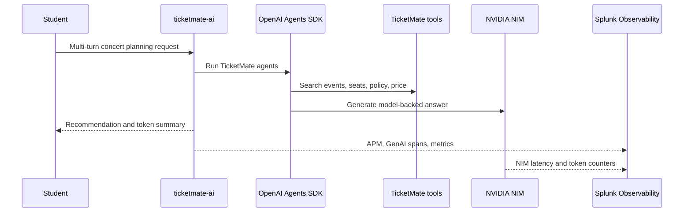

# 0. Orientation

## Goal

Understand the TicketMate AI workload and the observability path you will build.

TicketMate is a fictional concert-ticket assistant. Students browse events and use a multi-turn assistant to plan a concert night. The app uses five simple OpenAI Agents SDK agents and deterministic tools before calling a NIM-backed model.

## App Workflow



## Five Agents

| Agent | Job |
| --- | --- |
| `ConcertFinderAgent` | Finds matching fictional events |
| `SeatAdvisorAgent` | Reviews sections and inventory |
| `BudgetAgent` | Estimates total price with fees |
| `PolicyAgent` | Checks venue refund, transfer, parking, and accessibility rules |
| `CheckoutCoachAgent` | Produces the final no-payment recommendation |

## Observable Tools

The tools are intentionally deterministic. The model does not need to know real ticket facts.

```text
search_events
check_ticket_inventory
compare_seat_sections
lookup_venue_policy
estimate_total_price
```

## Success Criteria

You finish when:

- `ticketmate-ai` appears in APM
- GenAI spans and token metrics are visible
- tool-call activity is visible in traces where supported
- GPU/NIM metrics are visible
- a dashboard shows token spend by student and department
- a token spike detector fires during `token-surge`
