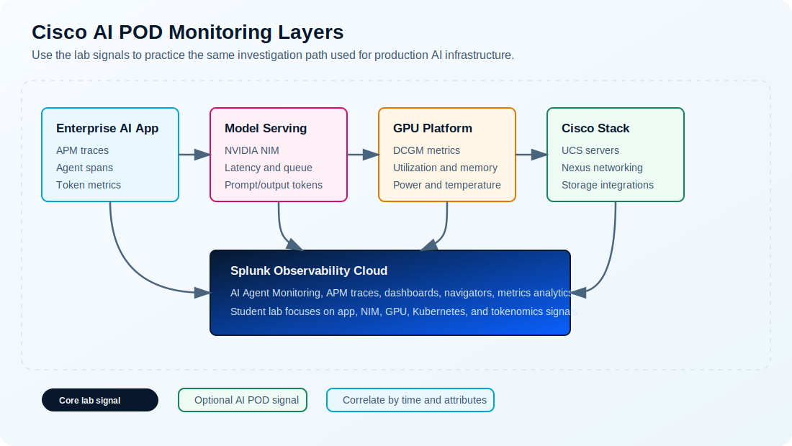
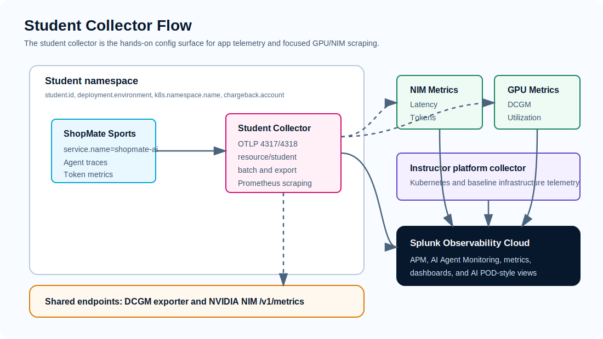

# AI POD Docs And Visuals

## Goal

Use this page when you need official Cisco AI POD and Splunk references, plus local visual maps that explain how this lab maps to production AI POD monitoring.

The diagrams on this page are lab-created visuals. They are not copied from Cisco or Splunk product documentation.

## Official Documentation

| Source | Use it for |
| --- | --- |
| [Cisco AI PODs data sheet](https://www.cisco.com/c/en/us/products/collateral/servers-unified-computing/ucs-x-series-modular-system/ai-pods-ds.html) | Product-level description of Cisco AI PODs, platform support, scale, and operational positioning |
| [AI Defense on Cisco AI PODs Reference Architecture](https://www.cisco.com/c/en/us/td/docs/unified_computing/ucs/UCS_CVDs/AI_defense_on_Cisco_AI_PODs_reference_architecture.html) | Example Cisco AI POD reference architecture with OpenShift, AI Defense, and deployment validation context |
| [Monitor Cisco AI PODs with Splunk Observability Cloud](https://help.splunk.com/en/splunk-observability-cloud/observability-for-ai/splunk-ai-infrastructure-monitoring/set-up-ai-infrastructure-monitoring/cisco-ai-pods) | Supported Cisco AI POD components and Splunk data collection setup sequence |
| [Monitor the performance of Cisco AI PODs](https://help.splunk.com/en/splunk-observability-cloud/observability-for-ai/splunk-ai-infrastructure-monitoring/monitor-and-troubleshoot-your-ai-infrastructure/monitor-the-performance-of-cisco-ai-pods) | Built-in Cisco AI POD dashboard access and dashboard customization guidance |
| [Splunk Cisco AI Pods workshop](https://splunk.github.io/observability-workshop/en/ninja-workshops/14-cisco-ai-pods/) | Public workshop pattern for participant collectors and GPU/NIM scraping |
| [Splunk OpenTelemetry Cisco AI-ready POD examples](https://github.com/signalfx/splunk-opentelemetry-examples/tree/main/collector/cisco-ai-ready-pods) | Collector examples, Prometheus scrape configuration, and metric filtering patterns |
| [Cisco AI POD GitHub repository](https://github.com/ucs-compute-solutions/Cisco-AI-POD) | Cisco AI POD reference material and sample assets |

## Visual 1: Monitoring Layers

Use this image when explaining the difference between:

- app and agent telemetry
- model-serving telemetry
- GPU and Kubernetes telemetry
- optional Cisco UCS, Nexus, and storage telemetry
- Splunk experiences that consume those signals

## Visual 2: Student Collector Flow

Use this image in Modules 1 through 3. It shows why the student collector is the hands-on surface for:

- receiving OTLP telemetry from `shopmate-ai`
- adding student and chargeback attributes
- exporting to Splunk Observability Cloud
- scraping shared DCGM and NIM endpoints

## Visual 3: Dashboard Coverage Map

Use this image when setting expectations for the `AI Pod overview` dashboard.

The core lab should populate app, AI agent, NIM, GPU, Kubernetes, and tokenomics views. Full Cisco AI POD dashboard coverage requires additional integrations such as UCS, Nexus, storage, and vector database telemetry.

## How This Lab Uses The References

| Lab module | AI POD documentation connection |
| --- | --- |
| Orientation | Cisco AI PODs are pre-validated, modular AI infrastructure; this lab uses an AI POD-inspired shared GPU environment |
| Data Journey | Splunk collects AI application and infrastructure telemetry through OpenTelemetry paths |
| Student Collector | The student collector pattern mirrors the public Splunk workshop while keeping Kubernetes metrics instructor-owned |
| App Instrumentation | AI Agent Monitoring and APM show the user-visible AI workflow |
| GPU and NIM Scraping | DCGM and NIM metrics map directly to the GPU/model-serving layer in AI POD monitoring |
| Correlation | The trace timestamp anchors drilldown into NIM, GPU, Kubernetes, and dashboard evidence |
| Tokenomics | Token metrics and chargeback dimensions explain cost and ownership of AI usage |

## Image Use Guidance

Use local images when the lab needs a quick mental model. Link to official docs when students need exact vendor setup details or current product screenshots.

Do not copy product screenshots from vendor documentation into this repo unless the event team has confirmed reuse rights.
