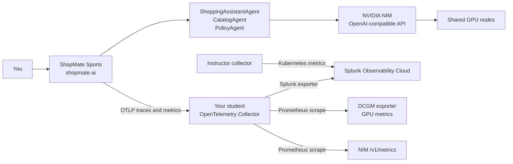

# Data Journey

## Goal

Follow one request from the ShopMate Sports agent app into Splunk, then drill from the agent trace into NIM and GPU signals in an AI POD-style monitoring workflow.

This page explains the full path. The module pages give you the detailed commands.

## Signal Path




## Step 1: Carry Your Lab Identity

Set the lab identity values before changing app or collector config:

```bash
export STUDENT_ID=student-01
export STUDENT_NAMESPACE=student-01
export TEAM_NAME=team-a
export DEPARTMENT_NAME=marketing
export DEPARTMENT_COST_CENTER=cc-4100
export CHARGEBACK_ACCOUNT=cb-student-01
export SPLUNK_REALM=us0
export SPLUNK_ACCESS_TOKEN_SECRET=splunk-observability-token
export LOGICAL_CLUSTER_NAME=clus-ltrobs-2001-student-01
```

These values become filters in Splunk. Without them, a shared lab tenant looks like one blended stream of traces and metrics.

## Step 2: Update The Collector Config

Open the collector file provided by the lab. It is usually one of these:

- `student-collector-values.yaml` for Helm
- `student-collector.yaml` for a rendered Kubernetes manifest

The first collector change should do four things:

| Config area | Why it matters |
| --- | --- |
| `otlp` receiver | Receives traces and metrics from `shopmate-ai` |
| `resource/student` processor | Adds student, department, namespace, environment, and chargeback attributes |
| Splunk exporter | Sends telemetry to Splunk Observability Cloud |
| `traces` and `metrics` pipelines | Activates the receivers, processors, and exporter |

Use this shape when reviewing the collector config:

```yaml
receivers:
  otlp:
    protocols:
      grpc:
        endpoint: 0.0.0.0:4317
      http:
        endpoint: 0.0.0.0:4318

processors:
  memory_limiter:
    check_interval: 1s
    limit_mib: 256
  resource/student:
    attributes:
      - key: student.id
        value: ${env:STUDENT_ID}
        action: upsert
      - key: team.name
        value: ${env:TEAM_NAME}
        action: upsert
      - key: department.name
        value: ${env:DEPARTMENT_NAME}
        action: upsert
      - key: department.cost_center
        value: ${env:DEPARTMENT_COST_CENTER}
        action: upsert
      - key: chargeback.account
        value: ${env:CHARGEBACK_ACCOUNT}
        action: upsert
      - key: deployment.environment
        value: ${env:STUDENT_ID}
        action: upsert
      - key: k8s.namespace.name
        value: ${env:POD_NAMESPACE}
        action: upsert
      - key: k8s.cluster.name
        value: ${env:LOGICAL_CLUSTER_NAME}
        action: upsert
  batch: {}

exporters:
  signalfx:
    realm: ${env:SPLUNK_REALM}
    access_token: ${env:SPLUNK_ACCESS_TOKEN}

service:
  pipelines:
    traces:
      receivers: [otlp]
      processors: [memory_limiter, resource/student, batch]
      exporters: [signalfx]
    metrics:
      receivers: [otlp]
      processors: [memory_limiter, resource/student, batch]
      exporters: [signalfx]
```

## Step 3: Redeploy The Collector

If the lab uses Helm:

```bash
helm upgrade --install student-collector "$COLLECTOR_CHART" \
  --namespace "$STUDENT_NAMESPACE" \
  --values student-collector-values.yaml
```

If the lab uses a rendered manifest:

```bash
kubectl apply -n "$STUDENT_NAMESPACE" -f student-collector.yaml
```

Validate the rollout:

```bash
kubectl rollout status deploy/student-collector -n "$STUDENT_NAMESPACE"
kubectl logs deploy/student-collector -n "$STUDENT_NAMESPACE" --tail=100
```

Expected result:

- OTLP HTTP receiver is listening on `4318`
- OTLP gRPC receiver is listening on `4317`
- Splunk exporter starts without authentication errors
- traces and metrics pipelines are created

## Step 4: Point The Agent App At The Collector

`shopmate-ai` should send OTLP to the collector service in the same namespace:

```bash
export OTEL_SERVICE_NAME=shopmate-ai
export OTEL_EXPORTER_OTLP_ENDPOINT=http://student-collector:4318
export OTEL_EXPORTER_OTLP_PROTOCOL=http/protobuf
export OTEL_RESOURCE_ATTRIBUTES="student.id=${STUDENT_ID},team.name=${TEAM_NAME},department.name=${DEPARTMENT_NAME},department.cost_center=${DEPARTMENT_COST_CENTER},chargeback.account=${CHARGEBACK_ACCOUNT},k8s.namespace.name=${STUDENT_NAMESPACE},deployment.environment=${STUDENT_ID},k8s.cluster.name=${LOGICAL_CLUSTER_NAME}"
```

Restart the app after changing its environment:

```bash
kubectl rollout restart deploy/shopmate-ai -n "$STUDENT_NAMESPACE"
kubectl rollout status deploy/shopmate-ai -n "$STUDENT_NAMESPACE"
```

## Step 5: Generate Agent Telemetry

Send a baseline prompt through the ShopMate Sports website:

```text
Find a waterproof hiking jacket under $200, check inventory, and explain the return policy.
```

Then find the trace in Splunk:

```text
service.name=shopmate-ai
student.id=<your student id>
deployment.environment=<your student id>
```

The trace is the anchor for the rest of the investigation. Record the request time, duration, model name, token counts, and the slowest span.

## Step 6: Add GPU And NIM Scraping

Now update the same collector config file to scrape shared GPU and NIM endpoints:

```yaml
receivers:
  prometheus/gpu_nim:
    config:
      scrape_configs:
        - job_name: dcgm
          scrape_interval: 60s
          static_configs:
            - targets:
                - ${env:DCGM_SCRAPE_TARGET}
        - job_name: nim
          scrape_interval: 60s
          metrics_path: /v1/metrics
          static_configs:
            - targets:
                - ${env:NIM_SCRAPE_TARGET}

processors:
  filter/gpu_nim_allowlist:
    metrics:
      include:
        match_type: regexp
        metric_names:
          - ^DCGM_FI_DEV_(GPU_UTIL|FB_USED|FB_FREE|GPU_TEMP|POWER_USAGE)$
          - ^DCGM_FI_PROF_(GR_ENGINE_ACTIVE|PIPE_TENSOR_ACTIVE)$
          - ^(num_requests_running|num_requests_waiting|prompt_tokens_total|generation_tokens_total|request_success_total|request_failure_total|e2e_request_latency_seconds|time_to_first_token_seconds|time_per_output_token_seconds|request_prompt_tokens|request_generation_tokens|http.server.active_requests)$

service:
  pipelines:
    metrics:
      receivers: [otlp, prometheus/gpu_nim]
      processors: [memory_limiter, resource/student, filter/gpu_nim_allowlist, batch]
      exporters: [signalfx]
```

Redeploy the collector again with Helm or `kubectl apply`, then wait at least three scrape intervals.

## Step 7: Drill Down In Splunk

Use the trace timestamp from Step 5.

| View | What to filter | What it tells you |
| --- | --- | --- |
| APM trace | `service.name=shopmate-ai`, `student.id` | Which agent, tool, or LLM span consumed time and tokens |
| AI Agent Monitoring | `deployment.environment`, `service.name` | Workflow shape, agent calls, LLM calls, token behavior |
| NIM metrics | `student.id`, `job=nim`, model label if present | Inference latency, active requests, queued requests, token throughput |
| GPU metrics | `student.id`, `job=dcgm`, GPU label if present | GPU utilization, memory, temperature, power, tensor activity |
| Kubernetes views | `k8s.namespace.name`, `service.name` | Whether the app pod was restarting or resource constrained |
| Cisco AI POD dashboard | search `Cisco AI PODs`, open `AI Pod overview` | AI POD-style infrastructure view where the available metrics match the dashboard |

The Cisco AI POD dashboard may not fully populate in this lab because UCS, Nexus, storage, and vector database integrations are not part of the core student exercise. Use GPU and NIM panels as the primary AI POD-style drilldown.

## Step 8: Explain The Finding

A complete finding connects evidence across layers:

```text
Trace:
Agent or tool span:
LLM/NIM span:
Prompt tokens:
Completion tokens:
NIM latency or queue:
GPU utilization and memory:
Kubernetes pod health:
Chargeback account:
Likely cause:
Recommended action:
```

!!! success "Checkpoint"
    You can explain how telemetry moved from the agent app to your collector, how the collector exported it to Splunk, and how a single trace led you to NIM and GPU evidence.
