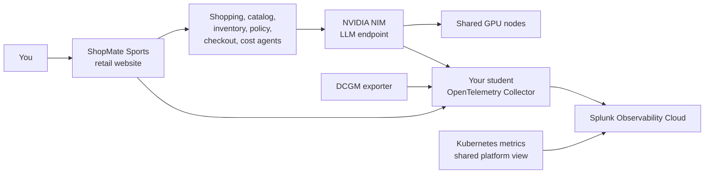

# CLUS-LTROBS-2001 Lab Guide

## From Deployment To Deep Insights

Welcome to the student lab guide for `CLUS-LTROBS-2001`.

In this lab you will work as an AI platform operator. Your job is to observe the ShopMate Sports retail website, connect its telemetry to Splunk Observability Cloud, inspect its multi-agent assistant trace flow, scrape GPU and NVIDIA NIM metrics, and finish with a tokenomics chargeback investigation.

!!! note "App Naming"
    Students use the **ShopMate Sports** website in the browser. In Kubernetes and Splunk, the workload may appear as `shopmate-ai` so the lab has a stable service name for traces, metrics, and dashboards.

This site is the path you follow during the workshop. It does not teach you how to build the shared cluster. The Kubernetes, GPU, NIM, and Splunk environment is already prepared for you.

## What You Will Do

By the end of the lab, you will be able to:

- Filter lab telemetry by your `student.id`, namespace, department, and cost center.
- Deploy or validate a namespace-scoped OpenTelemetry Collector.
- Send ShopMate Sports traces and metrics through your collector.
- Inspect a multi-agent AI trace with shopping, catalog, inventory, policy, checkout, cost, and NIM spans.
- Capture safe synthetic prompt and response content.
- Scrape shared GPU and NIM Prometheus metrics.
- Correlate app behavior, model-serving latency, GPU utilization, and Kubernetes health.
- Identify whether token spend came from normal use, a token surge, a bounded agent loop, retries, or missing chargeback tags.

## The Story

ShopMate Sports is a fictional athletic retail website with a shopping assistant. A shopper browses products, compares shoes and gear, checks inventory, asks return-policy questions, and gets cart recommendations. The assistant uses several small agents and calls NVIDIA NIM for the final customer-facing response.

The business question at the end is:

```text
Which department and student spent the most tokens, and was the spend properly chargeback-tagged?
```

You will answer that question using Splunk traces, metrics, dashboards, and resource attributes.

## Lab Architecture



## Lab Flow

| Time | Module | What You Produce |
| --- | --- | --- |
| 0:00-0:20 | Orientation | You understand the app, telemetry path, and final challenge |
| 0:20-0:55 | Student Collector | Your collector is running and exporting telemetry |
| 0:55-1:45 | App Instrumentation | You can find a full ShopMate Sports agent trace |
| 1:45-2:25 | GPU and NIM Scraping | Your collector scrapes shared GPU and NIM metrics |
| 2:25-2:50 | Correlation | You connect traces, NIM metrics, GPU metrics, and Kubernetes health |
| 2:50-3:40 | Tokenomics | You investigate token surge and agent-loop token burn |
| 3:40-4:00 | Final Review | You submit your evidence and recommendations |

## Your Lab Identity

Your lab handout gives you a student identity. You will use it throughout the lab.

Example:

```text
student.id=student-01
team.name=team-a
department.name=marketing
department.cost_center=cc-4100
chargeback.account=cb-student-01
k8s.namespace.name=student-01
deployment.environment=student-01
k8s.cluster.name=clus-ltrobs-2001-student-01
```

!!! success "Checkpoint"
    Before starting Module 1, you should know your namespace, Splunk login, department, cost center, and chargeback account.

## How To Use This Guide

Work through the modules in order. Each module has:

- a short explanation
- commands or UI actions
- expected results
- a checkpoint
- a knowledge check

Use the troubleshooting appendix when a checkpoint does not match your environment.
