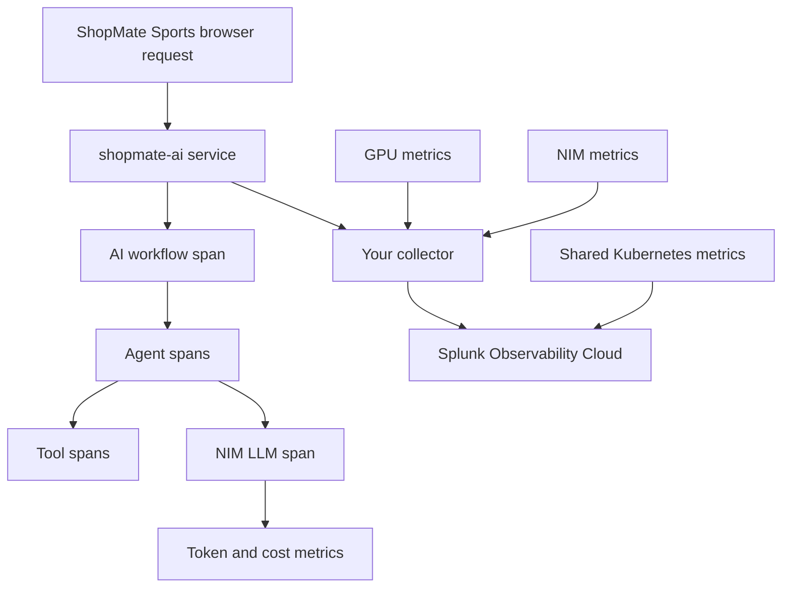

# 0. Orientation

## Goal

Understand the lab environment before you touch the collector or app.

You are working in a shared Cisco AI POD-inspired environment. The platform is already running. Your task is to observe an AI workload like an operator would.

The AI workload is the **ShopMate Sports** retail website. Students use the browser storefront and assistant. The Kubernetes deployment and Splunk service name may still be `shopmate-ai`.

## What Is Already Running

The shared lab environment includes:

- Kubernetes with GPU worker nodes
- NVIDIA GPU Operator
- DCGM exporter for GPU metrics
- NVIDIA NIM for model inference
- ShopMate Sports, the retail AI workload
- Splunk Observability Cloud
- shared Kubernetes/platform telemetry

You will not build those platform pieces during the lab.

## What You Will Control

Inside your namespace, you will work with:

- your student OpenTelemetry Collector
- your ShopMate Sports telemetry configuration
- your student, department, and chargeback attributes
- your Splunk filters, dashboards, and trace searches
- scenario traffic for tokenomics and agent-loop analysis

## Signal Map

## What To Look For During The Lab

As you move through the modules, keep asking:

- Did the request reach the app?
- Did the app emit workflow, agent, tool, and LLM spans?
- Did token metrics include student and chargeback attributes?
- Did NIM latency or GPU utilization change during token-heavy work?
- Did an agent loop burn tokens before guardrails stopped it?
- Can you explain the final chargeback result with evidence?

## AI POD Mapping

| Lab Signal | Production AI POD Meaning |
| --- | --- |
| App traces | User-visible AI workflow and application behavior |
| NIM metrics | Model-serving throughput, latency, queueing, and errors |
| DCGM metrics | GPU utilization, memory, temperature, power, and accelerator activity |
| Kubernetes metrics | Pod health, resource pressure, scheduling, and restarts |
| Token metrics | AI cost, model demand, and chargeback evidence |

This lab uses cloud-hosted shared infrastructure, so Cisco UCS, Nexus, and storage telemetry are not the focus. The reasoning model still maps to production: start from the user request, then correlate across app, model, GPU, and platform signals.

## Checkpoint

Before continuing, you should be able to say:

- what the ShopMate Sports website does
- where your collector fits
- why `student.id` matters
- what the final tokenomics question asks

## Knowledge Check

??? question "Why is the retail app not an observability chatbot?"
    The lab is more realistic when the app behaves like a normal business AI feature. Observability is what you add around the app.

??? question "What is the difference between a token surge and an agent loop?"
    A token surge can be legitimate high demand. An agent loop is repeated orchestration work, such as repeated catalog searches and NIM calls, that burns tokens before a guardrail stops it.
