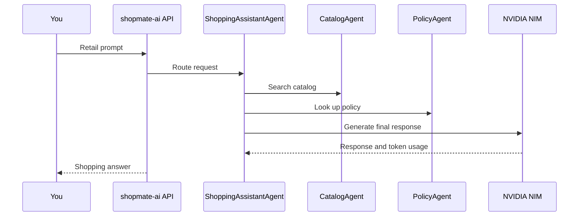

# 2. App Instrumentation

## Goal

Verify that the ShopMate Sports web app emits AI workflow telemetry that you can inspect in Splunk Observability Cloud.

You should finish this module with one complete trace that shows:

- the retail request
- agent spans
- tool spans
- the NIM LLM span
- prompt and response content for safe synthetic prompts
- token metrics
- student, department, namespace, and chargeback resource attributes

## The App Flow

The student-facing website is the ShopMate Sports storefront. In Kubernetes it can still be deployed as the `shopmate-ai` service so Splunk sees a stable service name, but students interact with the retail website in the browser.

The app uses a simple multi-agent pattern:



## Step 1: Point The App At Your Collector

Your app should export OTLP to the collector service in your namespace.

```bash
export OTEL_SERVICE_NAME=shopmate-ai
export OTEL_EXPORTER_OTLP_ENDPOINT=http://student-collector:4318
export OTEL_EXPORTER_OTLP_PROTOCOL=http/protobuf
```

Expected result:

- app telemetry goes to your collector
- your collector exports to Splunk

What these variables mean:

| Variable | Meaning | Splunk result |
| --- | --- | --- |
| `OTEL_SERVICE_NAME` | Sets the logical OpenTelemetry service name | Appears as `service.name=shopmate-ai` or the lab-provided service name in APM and trace search |
| `OTEL_EXPORTER_OTLP_ENDPOINT` | Base OTLP endpoint used by the app exporter | Sends app traces and metrics to your collector service |
| `OTEL_EXPORTER_OTLP_PROTOCOL` | OTLP transport and encoding | `http/protobuf` targets the collector OTLP HTTP receiver on port `4318` |

References:

- OpenTelemetry documents the OTLP endpoint and protocol environment variables in [OTLP Exporter Configuration](https://opentelemetry.io/docs/concepts/sdk-configuration/otlp-exporter-configuration/).
- OpenTelemetry defines SDK environment variable parsing rules in [Environment Variable Specification](https://opentelemetry.io/docs/specs/otel/configuration/sdk-environment-variables/).

Debug if telemetry does not arrive:

```bash
kubectl get svc -n "$STUDENT_NAMESPACE" student-collector
kubectl logs -n "$STUDENT_NAMESPACE" deploy/shopmate-ai --tail=100
kubectl logs -n "$STUDENT_NAMESPACE" deploy/student-collector --tail=100
```

If you see connection refused or DNS errors, confirm the collector service exists and the app is in the same namespace.

## Step 2: Confirm Resource Attributes

The app should include your identity:

```bash
export OTEL_RESOURCE_ATTRIBUTES="student.id=${STUDENT_ID},team.name=${TEAM_NAME},department.name=${DEPARTMENT_NAME},department.cost_center=${DEPARTMENT_COST_CENTER},chargeback.account=${CHARGEBACK_ACCOUNT},k8s.namespace.name=${STUDENT_NAMESPACE},deployment.environment=${STUDENT_ID},k8s.cluster.name=${LOGICAL_CLUSTER_NAME}"
```

In Splunk, you should be able to filter traces by:

```text
service.name=shopmate-ai
student.id=<your student id>
department.name=<your department>
chargeback.account=<your chargeback account>
```

Important mapping:

| Attribute | Splunk UI use |
| --- | --- |
| `service.name` | APM service map, service filters, trace search |
| `deployment.environment` | APM environment filter and related content |
| `k8s.namespace.name` | Link app telemetry to Kubernetes views |
| `student.id` | Isolate your work in a shared tenant |
| `department.name` | Tokenomics group-by dimension |
| `department.cost_center` | Chargeback reporting dimension |
| `chargeback.account` | Validate that AI spend is billable to the right owner |

These attributes do not come from website code. They are added by OpenTelemetry configuration through `OTEL_RESOURCE_ATTRIBUTES`, which is the zero-code path for lab identity and chargeback context.

## Step 3: Confirm GenAI Instrumentation

ShopMate Sports uses the OpenAI Agents SDK pointed at the NIM OpenAI-compatible endpoint. Splunk zero-code OpenAI and OpenAI Agents instrumentation should emit GenAI workflow, agent, and LLM telemetry without adding tracing calls to the app code.

Expected instrumentation settings:

```bash
export NIM_BASE_URL=http://nim-service.nim-system.svc.cluster.local:8000/v1
export NIM_MODEL=meta/llama-3.2-1b-instruct
export OTEL_INSTRUMENTATION_GENAI_EMITTERS=span_metric
export OTEL_INSTRUMENTATION_GENAI_CAPTURE_MESSAGE_CONTENT=SPAN_ONLY
export OTEL_EXPORTER_OTLP_METRICS_TEMPORALITY_PREFERENCE=delta
```

!!! warning "Prompt Capture"
    Only use fictional retail prompts. Prompt text is lab telemetry.

What these GenAI variables do:

| Variable | Lab value | Meaning | Splunk result |
| --- | --- | --- | --- |
| `NIM_BASE_URL` | NIM `/v1` endpoint | Points the OpenAI-compatible client at NIM. | LLM spans represent NIM-backed model calls |
| `NIM_MODEL` | lab model name | Selects the NIM model. | Model name appears on GenAI/OpenAI spans where supported |
| `OTEL_INSTRUMENTATION_GENAI_EMITTERS` | `span_metric` | Controls which GenAI telemetry emitters are active. `span_metric` emits spans and metrics for workflows, agents, and LLM calls. | Enables trace waterfalls and token metrics for AI Agent Monitoring/APM views |
| `OTEL_INSTRUMENTATION_GENAI_CAPTURE_MESSAGE_CONTENT` | `SPAN_ONLY` | Captures safe prompt and response content on spans only. | Lets you inspect synthetic prompts in trace details without also creating event copies |
| `OTEL_EXPORTER_OTLP_METRICS_TEMPORALITY_PREFERENCE` | `delta` | Requests delta temporality for OTLP metrics. | Helps Splunk process counter-style metric streams such as token counts |

The app must be started with `opentelemetry-instrument` after installing `shopmate-sports/requirements.txt`, which includes `splunk-otel-instrumentation-openai` and `splunk-otel-instrumentation-openai-agents`.

```bash
opentelemetry-instrument python shopmate-sports/server.py
```

This keeps the code path realistic: ShopMate Sports calls NIM through OpenAI-compatible SDKs, and Splunk-supported zero-code instrumentation observes those libraries.

References:

- Splunk AI Agent Monitoring setup: [Set up AI Agent Monitoring](https://help.splunk.com/en/splunk-observability-cloud/observability-for-ai/splunk-ai-agent-monitoring/set-up-ai-agent-monitoring).
- Splunk Python GenAI configuration: [Configure the Python agent for AI applications 0.1.14 and higher](https://help.splunk.com/en/splunk-observability-cloud/observability-for-ai/splunk-ai-agent-monitoring/configure-ai-agent-monitoring/configure-the-python-agent-for-ai-applications-0.1.14-and-higher).
- Splunk zero-code instrumentation: [Zero-code instrumentation](https://help.splunk.com/en/splunk-observability-cloud/observability-for-ai/splunk-ai-agent-monitoring/set-up-ai-agent-monitoring/zero-code-instrumentation).

## Step 4: Use The ShopMate Sports Website

Use the app URL provided by the instructor. If no URL is provided, port-forward the service:

```bash
kubectl port-forward -n "$STUDENT_NAMESPACE" svc/shopmate-ai 8080:8080
```

Open:

```text
http://127.0.0.1:8080/
```

If port `8080` is already in use:

```bash
kubectl port-forward -n "$STUDENT_NAMESPACE" svc/shopmate-ai 18080:8080
```

Then open:

```text
http://127.0.0.1:18080/
```

In the website:

1. Search or filter products.
2. Open one product detail.
3. Add one product to the cart.
4. Open the ShopMate assistant.
5. Send a baseline retail prompt.

Suggested baseline prompt:

```text
Find a waterproof hiking jacket under $200, check inventory, and explain the return policy.
```

Expected result:

- the website returns a shopping answer
- the token meter updates
- the NIM status shows either `NIM live` or `Local mode`
- telemetry appears in Splunk after the app and collector export path is working

??? tip "Optional API Debug"
    Use this only if the browser path is not working and you need to test the backend directly.

    ```bash
    curl -sS -X POST "http://127.0.0.1:8080/api/chat" \
      -H "content-type: application/json" \
      -d '{
        "message": "Find a waterproof hiking jacket under $200, check inventory, and explain the return policy.",
        "history": []
      }' | jq
    ```

Debug the request path:

```bash
kubectl get pods -n "$STUDENT_NAMESPACE" -l app=shopmate-ai
kubectl logs -n "$STUDENT_NAMESPACE" deploy/shopmate-ai --tail=100
kubectl describe deploy/shopmate-ai -n "$STUDENT_NAMESPACE"
```

Reset the app if you changed its configuration incorrectly:

```bash
kubectl rollout restart deploy/shopmate-ai -n "$STUDENT_NAMESPACE"
kubectl rollout status deploy/shopmate-ai -n "$STUDENT_NAMESPACE"
```

If the deployment is broken and the lab provides a baseline manifest, reapply it:

```bash
kubectl apply -n "$STUDENT_NAMESPACE" -f shopmate-ai.yaml
```

## Step 5: Inspect The Trace

In Splunk Observability Cloud:

1. Open APM or trace search.
2. Filter by `service.name=shopmate-ai` or the service name provided by the instructor.
3. Add `student.id=<your student id>`.
4. Open the latest trace.

Confirm the trace includes:

- `ShoppingAssistantAgent`
- `CatalogAgent`
- `PolicyAgent`
- OpenAI/OpenAI Agents SDK spans generated by Splunk zero-code instrumentation
- NIM-backed LLM call spans
- prompt tokens, completion tokens, and total tokens
- `chargeback.account`

If the trace is missing:

```bash
kubectl logs -n "$STUDENT_NAMESPACE" deploy/shopmate-ai --tail=100
kubectl logs -n "$STUDENT_NAMESPACE" deploy/student-collector --tail=100
kubectl get events -n "$STUDENT_NAMESPACE" --sort-by=.lastTimestamp
```

Then check Splunk with a wider time range, for example the last 15 minutes, and filter only by `service.name=shopmate-ai` before adding student filters.

!!! success "Checkpoint"
    You can explain the path from user prompt to agents to NIM to token accounting.

## Step 6: Trigger A More Expensive Multi-Agent Request

In the ShopMate assistant, send a deliberately difficult request:

```text
Find waterproof trail running shoes under $40, available today, with carbon plate support, in every color, and explain all alternatives in detail.
```

Expected result:

- the request returns instead of running forever
- the trace shows OpenAI Agents SDK activity
- the trace shows NIM-backed LLM activity
- token usage is higher than the baseline request

Reset if the app stops responding:

```bash
kubectl rollout restart deploy/shopmate-ai -n "$STUDENT_NAMESPACE"
```

## Knowledge Check

??? question "What span tells you the model was called?"
    The LLM invocation span, expected here as `llm.nim.chat_completion`.

??? question "What proves the token burn was caused by an agent loop?"
    In the zero-code version, you look for repeated or unusually expensive OpenAI Agents and NIM spans plus higher token metrics. Custom loop attributes are intentionally not emitted by the app.

## Troubleshooting

If no traces or token metrics appear, use the [troubleshooting appendix](appendix-troubleshooting.md#app-instrumentation-issues).
