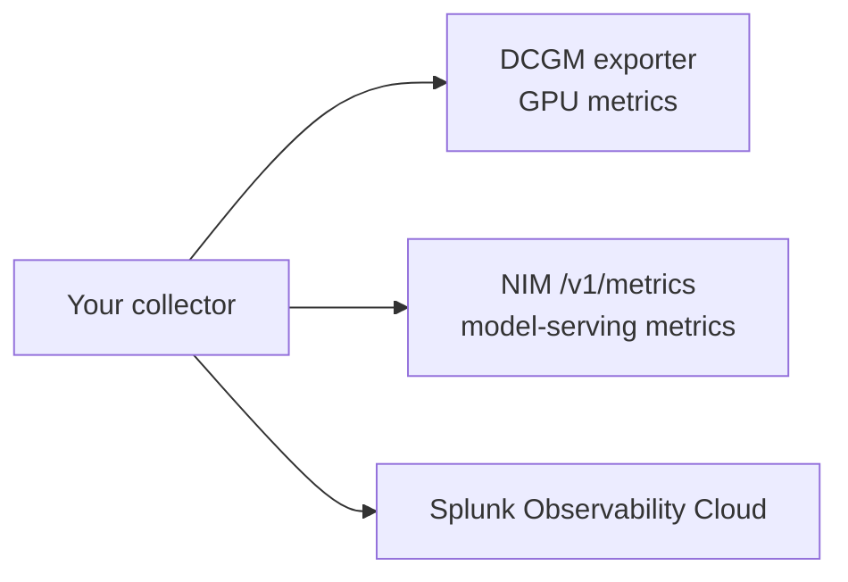

# 3. GPU And NIM Scraping

## Goal

Add Prometheus scraping to your collector for selected GPU and NVIDIA NIM metrics.

This gives you a view of model-serving and accelerator behavior during the same time window as your app traces.

## What You Are Scraping



The GPU and NIM endpoints are shared by the class. Your metrics are separated by labels such as `student.id`, `deployment.environment`, and `k8s.cluster.name`.

## Step 1: Confirm The Scrape Targets

Set the targets provided for the lab:

```bash
export DCGM_SCRAPE_TARGET=dcgm-exporter.gpu-system.svc.cluster.local:9400
export NIM_SCRAPE_TARGET=nim-service.nim-system.svc.cluster.local:8000
```

Test DCGM:

```bash
kubectl run scrape-test -n "$STUDENT_NAMESPACE" --rm -it --restart=Never \
  --image=curlimages/curl:8.10.1 -- \
  curl -sS "http://${DCGM_SCRAPE_TARGET}/metrics"
```

Test NIM:

```bash
kubectl run nim-test -n "$STUDENT_NAMESPACE" --rm -it --restart=Never \
  --image=curlimages/curl:8.10.1 -- \
  curl -sS "http://${NIM_SCRAPE_TARGET}/v1/metrics"
```

Expected result:

- both commands return Prometheus-formatted metrics

Cleanup the temporary test pods if they are left behind:

```bash
kubectl delete pod scrape-test nim-test -n "$STUDENT_NAMESPACE" --ignore-not-found
```

Debug if a target fails:

```bash
kubectl get events -n "$STUDENT_NAMESPACE" --sort-by=.lastTimestamp
kubectl run dns-test -n "$STUDENT_NAMESPACE" --rm -it --restart=Never \
  --image=busybox:1.36 -- nslookup "$(echo "$DCGM_SCRAPE_TARGET" | cut -d: -f1)"
```

If DNS works but curl fails, the issue is likely service port, path, or NetworkPolicy.

## Step 2: Add Prometheus Receiver Jobs

Your collector should include scrape jobs like this:

```yaml
receivers:
  prometheus/gpu_nim:
    config:
      scrape_configs:
        - job_name: dcgm
          scrape_interval: 60s
          static_configs:
            - targets:
                - ${DCGM_SCRAPE_TARGET}
        - job_name: nim
          scrape_interval: 60s
          metrics_path: /v1/metrics
          static_configs:
            - targets:
                - ${NIM_SCRAPE_TARGET}
```

How this maps to the collector:

| Config | Meaning |
| --- | --- |
| `prometheus/gpu_nim` | A named Prometheus receiver instance inside the collector |
| `job_name: dcgm` | Adds a scrape job label for GPU metrics |
| `job_name: nim` | Adds a scrape job label for NIM metrics |
| `scrape_interval: 60s` | Controls collection frequency and ingest volume |
| `metrics_path: /v1/metrics` | Uses the NIM Prometheus endpoint |

Make sure the receiver is also activated in a metrics pipeline. Defining a receiver without adding it to a pipeline is a common collector mistake.

## Step 3: Keep The Metric Set Focused

Use a focused GPU allowlist:

```text
DCGM_FI_DEV_GPU_UTIL
DCGM_FI_DEV_FB_USED
DCGM_FI_DEV_FB_FREE
DCGM_FI_DEV_GPU_TEMP
DCGM_FI_DEV_POWER_USAGE
DCGM_FI_PROF_GR_ENGINE_ACTIVE
DCGM_FI_PROF_PIPE_TENSOR_ACTIVE
```

Use NIM metrics that explain:

- request rate
- active and waiting requests
- request latency
- time to first token
- prompt tokens
- generation tokens
- errors

This keeps the lab fast and avoids flooding Splunk with duplicate metrics from every student.

Reference:

- Splunk AI Infrastructure Monitoring uses the Splunk Distribution of OpenTelemetry Collector for AI infrastructure data integrations: [Set up AI Infrastructure Monitoring](https://help.splunk.com/en/splunk-observability-cloud/observability-for-ai/splunk-ai-infrastructure-monitoring/set-up-ai-infrastructure-monitoring).
- Splunk Collector troubleshooting lists common reasons a collector does not receive, process, or export data: [Troubleshoot the Splunk OpenTelemetry Collector](https://help.splunk.com/en?resourceId=gdi_opentelemetry_splunk-collector-troubleshooting).

## Step 4: Restart The Collector

```bash
kubectl rollout restart deploy/student-collector -n "$STUDENT_NAMESPACE"
kubectl rollout status deploy/student-collector -n "$STUDENT_NAMESPACE"
kubectl logs deploy/student-collector -n "$STUDENT_NAMESPACE" --tail=100
```

Wait at least three scrape intervals. With a 60-second scrape interval, expect 3 to 5 minutes before charts look populated.

If the collector does not restart cleanly:

```bash
kubectl logs deploy/student-collector -n "$STUDENT_NAMESPACE" --previous --tail=100
kubectl describe deploy/student-collector -n "$STUDENT_NAMESPACE"
kubectl get configmap -n "$STUDENT_NAMESPACE" student-collector -o yaml
```

Reset this step:

```bash
helm rollback student-collector -n "$STUDENT_NAMESPACE"
```

If Helm rollback is not available, reapply the last known good `student-collector-values.yaml` or `student-collector.yaml` from the lab materials.

## Step 5: Validate In Splunk

Filter by:

```text
student.id=<your student id>
deployment.environment=<your student id>
k8s.cluster.name=<your logical cluster name>
```

Look for:

| Signal | Why It Matters |
| --- | --- |
| `DCGM_FI_DEV_GPU_UTIL` | Whether inference uses GPU resources |
| `DCGM_FI_DEV_FB_USED` | GPU memory pressure |
| `DCGM_FI_PROF_PIPE_TENSOR_ACTIVE` | Accelerator activity |
| NIM request latency | Model-serving experience |
| NIM queue or active request metrics | Inference pressure |
| NIM token metrics | Demand created by prompts and completions |

Splunk filtering tips:

| Signal | Useful filters or group-bys |
| --- | --- |
| GPU metrics | `student.id`, `deployment.environment`, `k8s.cluster.name`, GPU/device label if present |
| NIM metrics | `student.id`, `deployment.environment`, `model`, `job`, `instance` |
| App traces | `service.name=shopmate-ai` or the lab-provided ShopMate service name, `student.id`, `deployment.environment`, `department.name` |
| Kubernetes views | `k8s.namespace.name`, `k8s.pod.name`, `service.name` |

!!! success "Checkpoint"
    You can see GPU and NIM metrics under your student identity.

## Knowledge Check

??? question "Why are GPU metrics logically isolated but not physically isolated?"
    The class shares GPU infrastructure. Your collector tags the metrics with your identity, but the hardware is shared.

??? question "Why use a metric allowlist?"
    It controls duplicate ingest and keeps the lab focused on signals that explain GPU pressure, NIM latency, and token demand.

## Troubleshooting

If scrape targets are unreachable or dashboards stay empty, use the [troubleshooting appendix](appendix-troubleshooting.md#gpu-and-nim-issues).
