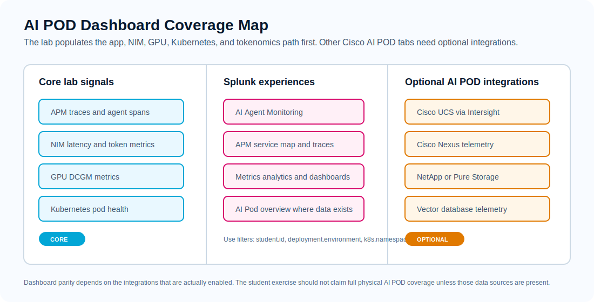
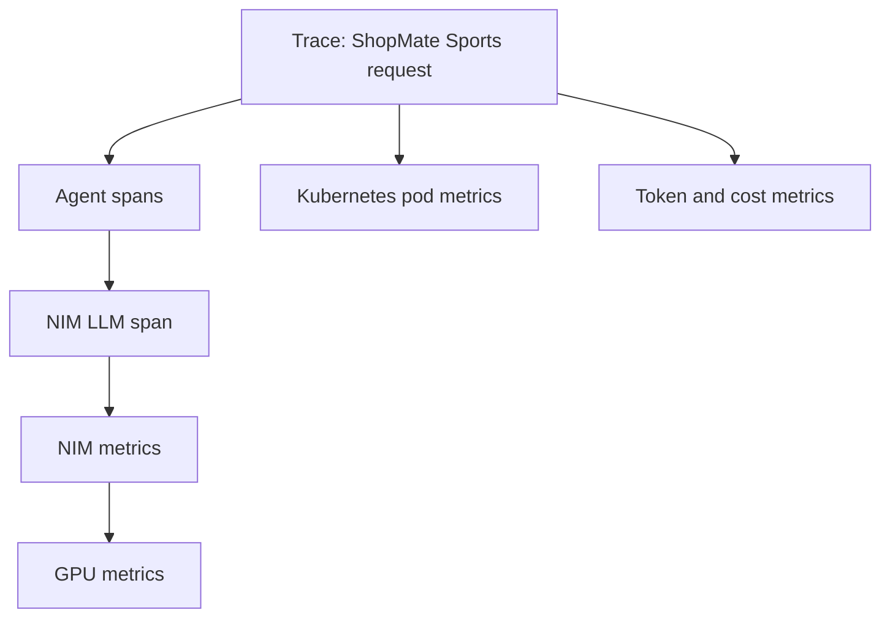

# 4. Correlation

## Goal

Use Splunk Observability Cloud to connect one user request to app behavior, model-serving behavior, GPU behavior, and Kubernetes health.

This is the operator workflow: start with the symptom, then gather enough related evidence to explain it.

Use the [Data Journey](data-journey.md) as the map for this module. Here you run the drilldown: trace first, then NIM metrics, then GPU metrics, then Kubernetes health.



## Correlation Path



## Step 1: Start From A Trace

In Splunk Observability Cloud:

1. Open APM or trace search.
2. Filter for `service.name=shopmate-ai` or the lab-provided ShopMate service name.
3. Add `student.id=<your student id>`.
4. Open a recent baseline trace.
5. Record the trace start time and duration.

Find:

- workflow span
- agent spans
- tool spans
- NIM LLM invocation span
- token accounting span

Expected result:

- the trace shows where the request spent time

## Step 2: Compare Baseline And Agent Loop

Open the `agent-loop-token-burn` trace from Module 2.

Compare it with your baseline trace:

| Question | Baseline | Agent Loop |
| --- | --- | --- |
| How many `CatalogAgent` spans? |  |  |
| How many NIM spans? |  |  |
| Total tokens? |  |  |
| Request duration? |  |  |
| Stop reason? |  |  |

Expected result:

- the loop trace has repeated catalog and NIM spans
- token usage is higher
- the loop stops at a guardrail

## Step 3: Correlate To NIM Metrics

Use the trace timestamp to inspect NIM metrics around the same time.

Look for:

- request latency
- active requests
- waiting or queued requests
- prompt token counters
- generation token counters
- errors

Ask:

- Did the slow trace line up with higher NIM latency?
- Did repeated NIM calls create more token demand?
- Did the problem look like NIM pressure, app orchestration, or both?

Useful Splunk filters:

```text
student.id=<your student id>
deployment.environment=<your student id>
job=nim
```

## Step 4: Correlate To GPU Metrics

Inspect GPU metrics around the same time window:

```text
DCGM_FI_DEV_GPU_UTIL
DCGM_FI_DEV_FB_USED
DCGM_FI_DEV_FB_FREE
DCGM_FI_PROF_GR_ENGINE_ACTIVE
DCGM_FI_PROF_PIPE_TENSOR_ACTIVE
```

Ask:

- Was the GPU active during the request?
- Did GPU utilization rise during token-heavy work?
- Was the workload waiting in app orchestration rather than saturating GPU?

Useful Splunk filters:

```text
student.id=<your student id>
deployment.environment=<your student id>
job=dcgm
```

For an AI POD-style view, open Dashboards, search for `Cisco AI PODs`, and open `AI Pod overview`. In this lab, use the GPU and NIM panels as the primary drilldown. UCS, Nexus, storage, and vector database panels may stay empty unless the instructor enabled those integrations.

## Step 5: Check Kubernetes Health

Use shared Kubernetes views filtered by your namespace:

```text
k8s.namespace.name=<your namespace>
service.name=shopmate-ai
```

Ask:

- Was the app pod restarting?
- Was the app CPU or memory constrained?
- Did Kubernetes look healthy while the app looped?
- Did the issue come from the app workflow rather than the platform?

## Evidence Table

Fill this out before moving to Module 5.

| Evidence | What You Found |
| --- | --- |
| Highest-duration span |  |
| Number of NIM calls |  |
| Prompt tokens vs completion tokens |  |
| GPU utilization during request |  |
| Kubernetes pod health |  |
| Likely cause |  |

!!! success "Checkpoint"
    You can explain whether a slow or expensive request came from app orchestration, NIM/model serving, GPU pressure, Kubernetes health, or chargeback tagging.

## Knowledge Check

??? question "Why start from a trace instead of a dashboard?"
    The trace anchors the investigation to one user-visible transaction. You can then use the trace timestamp and attributes to inspect related metrics.

??? question "What evidence would point to app orchestration instead of GPU pressure?"
    Repeated agent/tool spans, repeated NIM calls, loop-detection attributes, and normal GPU utilization would point toward the app workflow.
